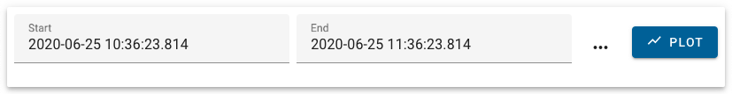
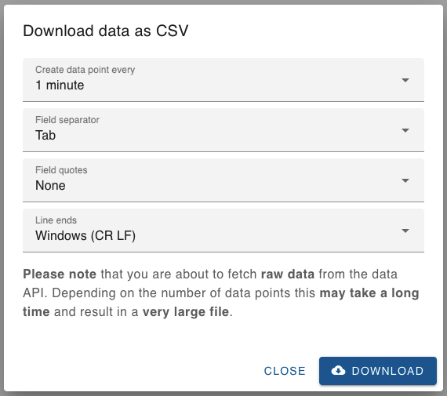

# How to download channel data

This document will guide you through the steps to download data from the data API using _databuffer UI_.

## Scenario

For the purpose of this guide, let's assume we want to download the data of the _last 4 hours_ with a data point _every 5 seconds_ of the following _channels_:

- SINEG01-CMON-DIA0091:CURRENT-3-3
- SINEG01-CMON-DIA0091:CURRENT-5
- SINEG01-CMON-DIA0091:FAN-SPEED
- SINEG01-CMON-DIA0091:POWER-TOT

## Step-by-step instructions

### Step 1: Select the channels for plotting

Open _databuffer UI_ in your browser and search for `SINEG01-CMON-DIA0091`. From the search results select these channels:

- SINEG01-CMON-DIA0091:CURRENT-3-3
- SINEG01-CMON-DIA0091:CURRENT-5
- SINEG01-CMON-DIA0091:FAN-SPEED
- SINEG01-CMON-DIA0091:POWER-TOT

Click on button _plot selected_  to change to the _plot_ view.

### Step 2: Select time range

On the _plot_ view, check if the text fields for _Start_ and _End_ are displayed:

If they are not currently displayed, click the _select plot range_ tool button .

Now click on the _quick dial button_  and from the list select "last 1h". Then enter the _Start_ text field and adjust the hours, so that the time difference between _Start_ and _End_ is 4 hours.

Finally, turn the switch _Query expansion_  on. This will make sure, our first time stamp does have a data point.

If you want, you can preview the plot by clicking the _plot button_ .

**Please note:** Whether you plot the PVs or not is of no consequence to the CSV download.

### Step 3: Download data

Click the _download data_ tool button  to bring up the _Download data as CSV_ dialog.

Because our scenario said, we want to download the data with a data point _every 5 seconds_, open the selection _Create data point every_ and choose entry _5 seconds_.

Click the _download_ button  to download the data in CSV format.

The download from data API will start in the background. Once it has finished it will appear in your browser's downloads. This may take a long time, because there may be a lot of data.

> **Side note**
>
> The UI will always **request raw data**, in order to create the CSV data you requested.
>
> It will then re-interpret the data and create completely new data points from it.
