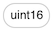
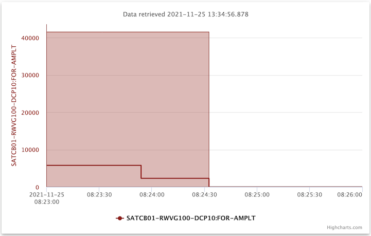
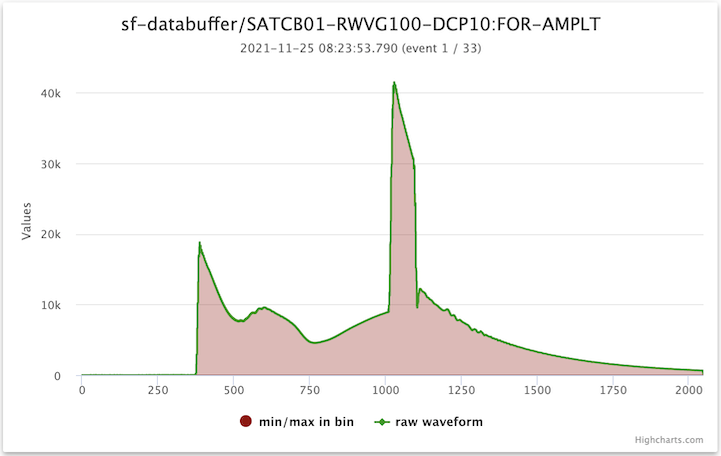

# How to plot wave forms with the index plot

This document will guide you through the steps to view the data in a wave form using _databuffer UI_.

## Scenario

For the purpose of this guide, let's assume we want to investigate a wave form around some anomaly that occurred. These are the channels of interest:

- Channel: SATCB01-RWVG100-DCP10:FOR-AMPLT
- Backend: sf-databuffer
- Time range: 2021-11-25 between 08:00 and 08:30

## Step-by-step instructions

### Step 1: Select the channel for plotting

Open _databuffer UI_ in your browser and search for `SAT.*RW.*AMPLT$`. From the search results select channel _SATCB01-RWVG100-DCP10:FOR-AMPLT_ from backend _sf-databuffer_.

Notice that in the list of the search resulst, there are several indicators, i.e. for the backend, the data type, and the "shape" or dimensions of the channel. In this case, these are: , , and . ("1d" stands for "1-dimensional array", which is the shape of a wave form.)

Click on button _plot selected_  to change to the _plot_ view.

### Step 2: Select time range and plot

On the _plot_ view, check if the text fields for _Start_ and _End_ are displayed:

If they are not currently displayed, click the _select plot range_ tool button .

Enter the start time `2021-11-25 08` and the end time `2021-11-25 08:30`. Click on the _plot button_  and wait for the plot to be displayed.

Notice, that although this channel is a wave form (a 1d array), it is displayed just like a scalar value. That is because all the values in a single event are first reduced to a single value (the mean). Also, all the time range is divided into _bins_ of equal size, and the minimum, mean, and maximum value within the bin are plotted as a single data point; the maximum and minimum are displayed as an area / band in the background of the mean value.

### Step 3: View raw wave forms in bin

Click on the data point at about 08:23:50. The UI will change to load the index plot view.

You can see the area / band of the minimum and maximum for the entire time bin in the background, and the curve of this particular event on top of it.

The current event in the bin is indicated in the subtitle of the plot. In the screenshot that is "(event 1 / 33)". To navigate the events in the time bin, you can use the toolbar buttons:

- Go to the first event in the bin: 
- Go to the previous event in the bin: 
- Go to the next event in the bin: 
- Go to the last event in the bin: 

You can also zoom and move around in the index plot, as is described in the guide [how to zoom and navigate in a plot](./zoom_navigate_plot.md), except for "zoom with fetching data" (as you are viewing raw data already).
