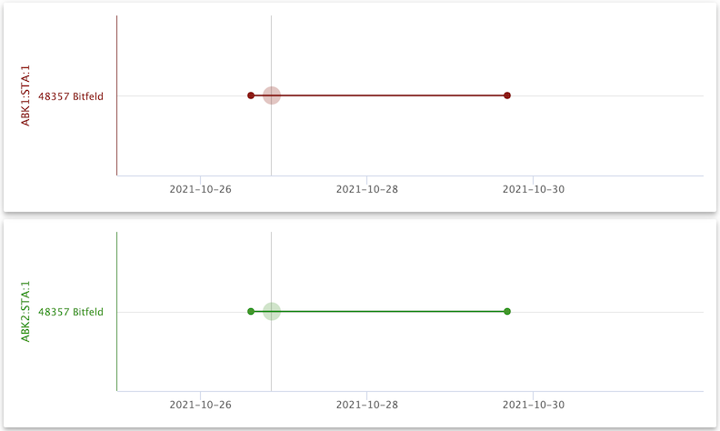
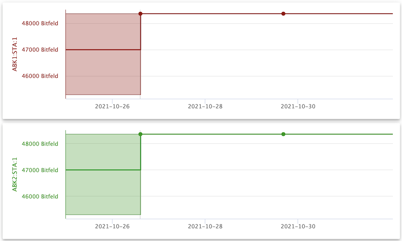

# How to extend the query range

This document will guide you through the steps to create a plot that "extends beyond" the time range you originally want to view. This allows the line plot of the values to reach all the way to the edges of the chart.
This comes in handy when plotting "slow" values (e.g. manually set values) together with "fast" ones.

## Scenario

You want to plot these channels over the week starting on 2021-10-25:

- ABK1:STA:1
- ABK2:STA:1

## Step-by-step instructions

### Step 1: Select the channels for plotting

Open _databuffer UI_ in your browser and search for `^ABK.*:STA:1$`. From the search results select these channels:

- ABK1:STA:1
- ABK2:STA:1

Click on button _plot selected_  to change to the _plot_ view.

### Step 2: Select time range

On the _plot_ view, check if the text fields for _Start_ and _End_ are displayed:

If they are not currently displayed, click the _select plot range_ tool button .

Enter the start time `2021-10-25` and the end time `2021-10-31 23:59:59.999`. Click on the _plot button_  and wait for the plot to be displayed.

**Please note**, how there are gaps to the left and right of the displayed plot. This is because, within the time range requested, the first and last data points are "far away" from the actual start and end time.

### Step 3: Turn on query expansion

Turn on the _query expansion switch_ , click the _plot button_ again, and wait for the updated plot to be displayed.

**Please note**, how now there are no gaps to the left and right. The query expansion feature of Data API has provided the last data point before the start time, and the next data point after the end time, so the line plot could be continued all the way to the edges.
