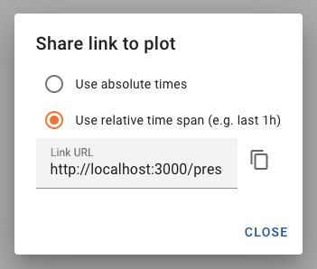

# How to share a link to a plot

This document will guide you through the steps to create a (HTTP) link to a plot in _databuffer UI_. When a browser visits that link, it will show a preconfigured plot. Such a link can then be put on a panel next to the live data to provide easy access to the archived data. You could also put that link somewhere else, e.g. on a wiki page, in an email to a colleague, or in a log entry.

The link we'll create will look something like this:

`https://my-data-ui.psi.ch/preselect?c1=sf-archiverappliance%2FSINEG01-CMON-DIA0091%3ACURRENT-3-3&c2=sf-archiverappliance%2FSINEG01-CMON-DIA0091%3ACURRENT-5&c3=sf-archiverappliance%2FSINEG01-CMON-DIA0091%3AFAN-SPEED&c4=sf-archiverappliance%2FSINEG01-CMON-DIA0091%3APOWER-TOT&duration=14400000`

## Scenario

For the purpose of this guide, let's assume we want to plot the _last 4 hours_ of the following _channels_:

- SINEG01-CMON-DIA0091:CURRENT-3-3
- SINEG01-CMON-DIA0091:CURRENT-5
- SINEG01-CMON-DIA0091:FAN-SPEED
- SINEG01-CMON-DIA0091:POWER-TOT

## Step-by-step instructions

### Step 1: Select the channels for plotting

Open _databuffer UI_ in your browser and search for `SINEG01-CMON-DIA0091`. From the search results select these channels:

- SINEG01-CMON-DIA0091:CURRENT-3-3
- SINEG01-CMON-DIA0091:CURRENT-5
- SINEG01-CMON-DIA0091:FAN-SPEED
- SINEG01-CMON-DIA0091:POWER-TOT

Click on button _plot selected_  to change to the _plot_ view.

### Step 2: Select time range

On the _plot_ view, check if the text fields for _Start_ and _End_ are displayed:

If they are not currently displayed, click the _select plot range_ tool button .

Now click on the _quick dial button_  and from the list select "last 1h". Then enter the _Start_ text field and adjust the hours, so that the time difference between _Start_ and _End_ is 4 hours.

If you want, you can preview the plot by clicking the _plot button_ .

### Step 3: Copy link

Click the _share link_ tool button  to bring up the _Share link to plot_ dialog.

Because our scenario said, we want to plot the last 4 hours when we visit that link, choose _relative times_.

Click the _copy URL_ button  to copy the URL to the clipboard.

> **Side note**
>
> In the dialog, you can choose, if you want to use _absolute times_ or a _relative time span_.
>
> - **Absolute times** will retain the exact values for _Start_ and _End_. This is useful, if you'd like to use that link in a **static context**, e.g. in a log entry.
> - **Relative times** will always set _End_ to "right now" and calculate _Start_ dynamically. This is useful, if you'd like to use that link in the **context of ongoing operation**, e.g. for putting it on a panel or into documentation of operation procedures.

### Step 4: Test the link

Just to be sure, that everything works as expected, open a new browser tab or window, paste the link in the address bar, and open it. The browser should open up _databuffer UI_ and take you to a plot with

- the exact same channels
- _End_ set to the current time
- _Start_ 4 hours before _End_

## Outlook

This how-to guide showed you how to share the link to a plot that you configured inside of _databuffer UI_. Such a link could also be generated programmatically. In that case you'll need to construct all the parts of the link yourself. You can find all the details on the available parameter names and values in the [reference on URL parameters for `/preselect`][reference].

Note, that you'll need to convert the parameter values into a format suitable for use in a URL. If you're not familiar with that, have a look at the background information on [working with URL query strings][query strings].

[query strings]: ../background/query_strings.md
[reference]: ../reference/url_params_preselect.md
