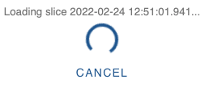

# How to view images from a camera channel

This document will guide you through the steps to view images from a channel using _databuffer UI_.

## Scenario

For the purpose of this guide, let's assume we want to view the images recorded from this channel:

- SARES20-CAMS142-M3:FPICTURE

## Step-by-step instructions

### Step 1: Select the channel for plotting

Open _databuffer UI_ in your browser and search for `SARES.*FPICTURE`. Limit the search results to image channels by clicking on the .

Now select channel _SARES20-CAMS142-M3:FPICTURE_.

Click the _view button_  to change to the _image viewer_ view.

### Step 2: Select time range

On the _correlation plot_ view, click on the _quick dial button_  and from the list select "last 1h".

Download the first slice of data by clicking the _plot button_ .

If you want to load the next slice, click the _load more button_ .

> **Side note**
>
> Databuffer UI will always **request data in slices of 10 seconds**, in order not to overwhelm the backend.
>
> It might take a while to find the first slice that has some data. If you want to abort the process click the _cancel button_  in the progress indicator .
