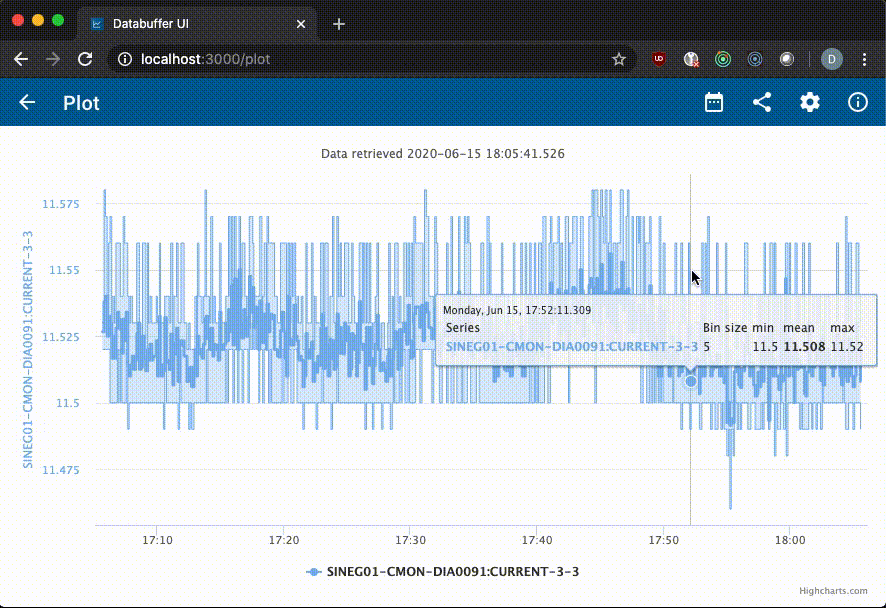
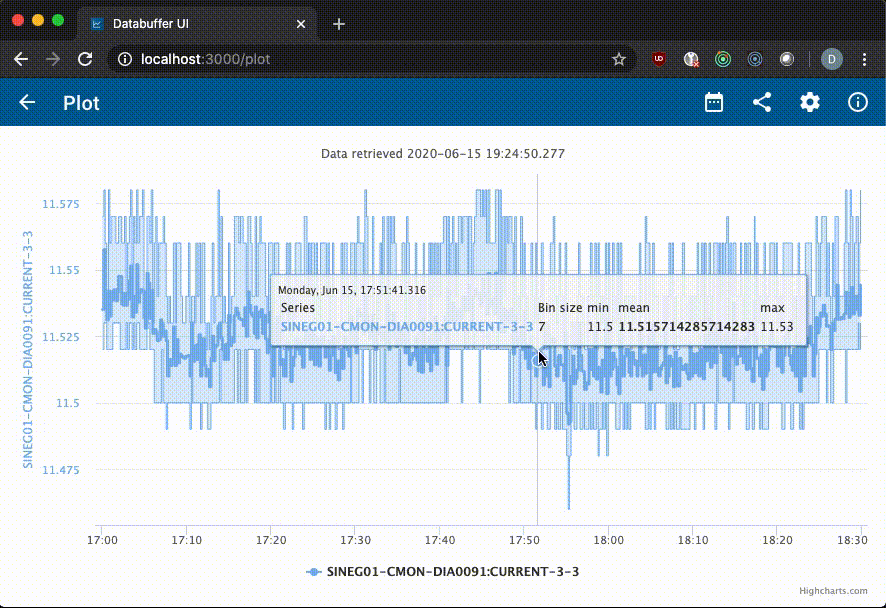
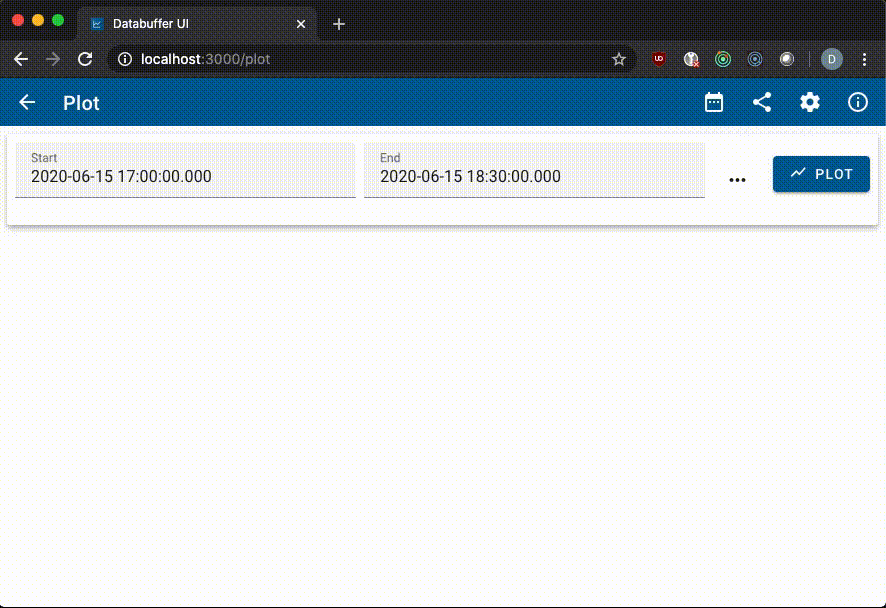

# How to zoom and navigate in a plot

You can navigate around the plot with the mouse using 3 different operations:

- Zoom in and out
- Pan around
- Zoom with fetching data

## Zooming in and out

To zoom in, drag a rectangle over the area of interest on the plot. To zoom out again, click the _reset zoom_ button:

**Please note**, that zooming in did not fetch any new data. I.e. the data the plot already had was displayed using up more of the screen. The result of this is, that the steps in the plot get wider, but the bin sizes of the aggregated data stay the same.

## Panning around

While zoomed in, you can move the zoomed in area around by holding the <kbd>shift</kbd> key and dragging the mouse:

## Zoom with fetching data

If you hold down the <kbd>Ctrl</kbd> key (<kbd>Cmd</kbd> on Mac computers) while dragging the rectangle to zoom in, _databuffer UI_ will **fetch new data**. The left and right edges will become the new _Start_ and _End_ of the plot range, and a new query is sent for data. That means, that for aggregated data, your number of data points per bin will go down, and hence actually your **plot's accuracy increases**. In the animation you can see, that the inital data is aggregated: A band is showing the min and max values, and the tooltip on the data points shows a bin size of 8. After zooming in with fetching data, the displayed data are raw single data points, without aggregation.

