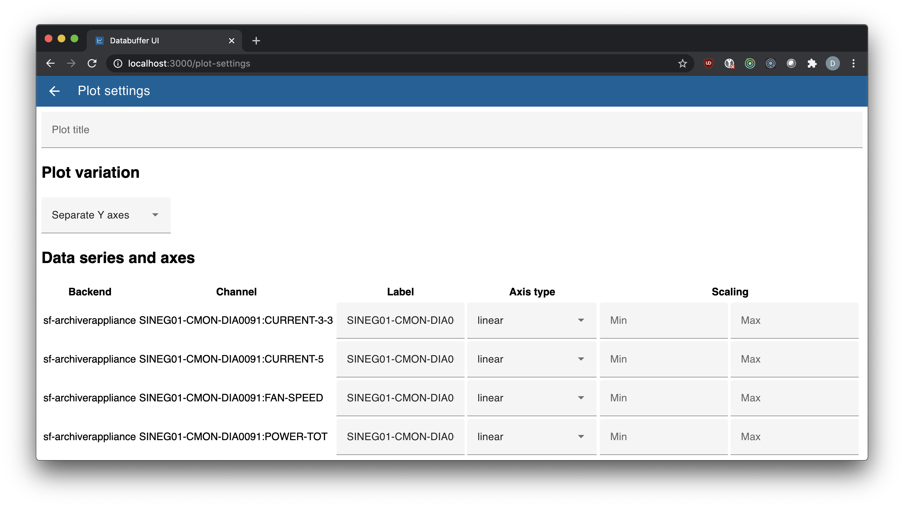
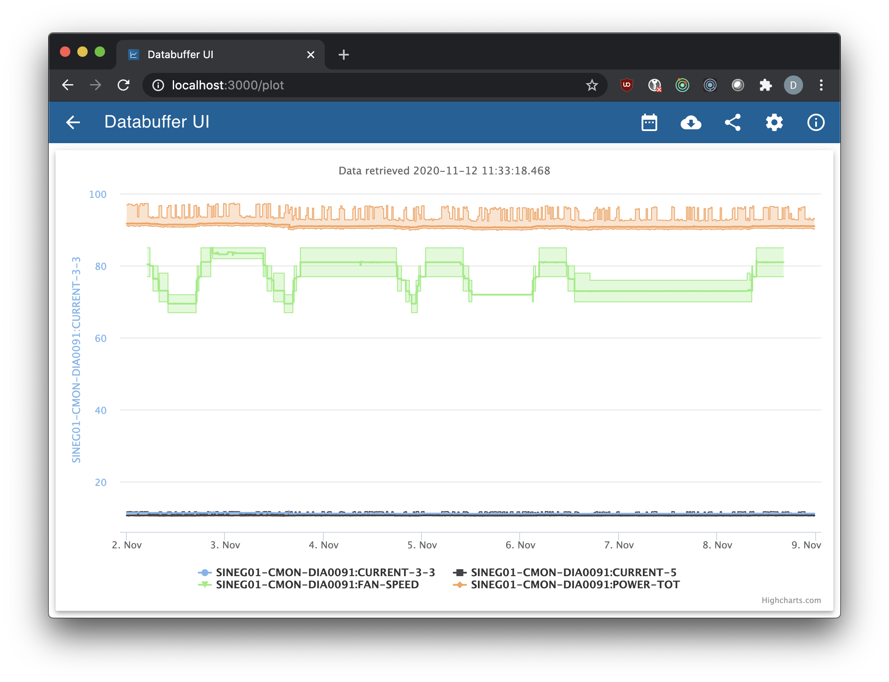
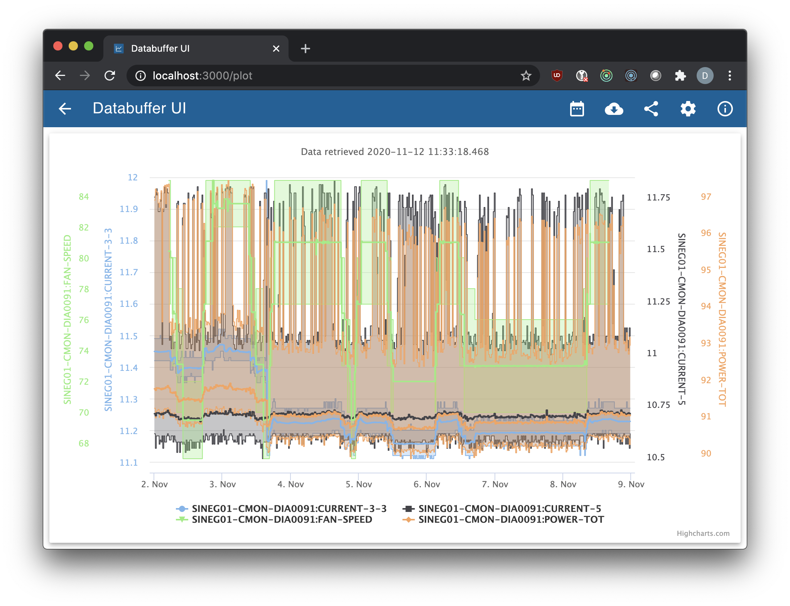
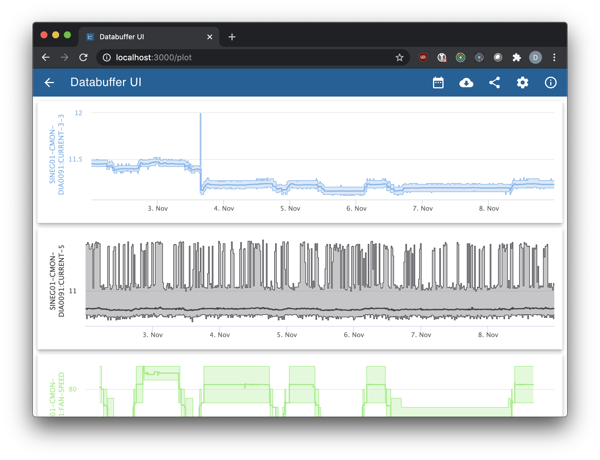

# View: Plot Settings

The _Plot Settings_ view allows you to adjust various settings on how the data in the plot will be displayed.

## Plot Title

The plot title is displayed at the top of the plot for the plot variations _Single Y Axis_ and _Separate Y Axes_.

For plot variation _Separate plots_ the plot title is **not** displayed.

## Plot Variation

_databuffer-ui_ supports different plot variations. You can see here the different presentation of the same four channels.

**Note:** Switching from one plot variation to the other keeps your axes' settings, so you can try it out without losing your settings.

### Plot Variation: Single Y Axis

There is a single chart, and all channels are put on the Y axis of the first data series.

### Plot Variation: Separate Y Axes

There is a single chart, and each channel is put on its own Y axis.

### Plot Variation: Separate Plots

There are multiple charts. Each channel is put in a single plot with only one Y axis.

The vertical crosshair line, tooltips, and X axes are synchronized, so you can easily visually correlate the charts of the channels in comparison to each other.

**Note:** Each plot maintains a minimum height, to be still useful. You may need to scroll the view down to see the remaining plots.

## Data Series and Axes

The data series and axes are presented in a table.

- Column "Backend": Indicates where the channel is obtained from. (Some channels are recorded in more than one backend.)
- Column "Channel": Indicates, which channel is being plotted.
- Column "Label": The label for the data series and Y axis. Defaults to the channel name.
- Column "Axis Type": The type of the axis, _linear_ or _logarithmic_.
- Column "Scaling": The minimum and maximum values of the Y axis. When empty, it will use automatic scaling based on the values in the data series.
